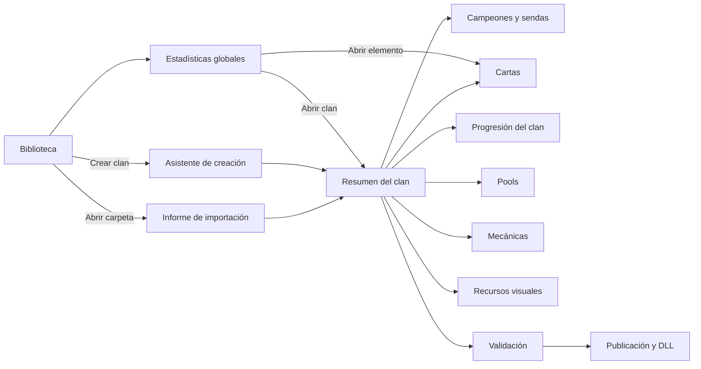

# Plan funcional detallado — Editor de clanes MT2

Estado: especificación funcional; el primer incremento está implementado y sus límites figuran en [README.md](README.md). Fecha: 28-09-2026. El [borrador anterior](BORRADOR.md) queda como antecedente; este documento define el alcance vigente.

## 1. Objetivo y límites

Aplicación local y multiplataforma (Windows, macOS y Linux), escrita en TypeScript, para **crear, abrir, comparar y modificar** clanes de Monster Train 2 basados en Trainworks Reloaded. La primera versión debe abrir las siete carpetas de referencia: The Free Company, SuccClan, Sandscourged, The Silk Song, Pathogens, Equestrian y Yokai. Deva queda fuera del alcance inicial por decisión del usuario. Un clan nuevo debe poder generarse, compilarse y cargarse en el juego.

El editor trabaja con archivos. No utiliza una base de datos como fuente de verdad. Reglas del juego, campos y formularios, catálogos de mecánicas, importación, perfiles de arte, métricas, navegación y plantillas se definen en **ficheros de configuración versionados**. El código TypeScript implementa operaciones genéricas: leer, presentar formularios, resolver referencias, validar, transformar imágenes y guardar. Las credenciales se guardan mediante el sistema operativo o la herramienta de autenticación, nunca en el proyecto.

Un clan importado conserva su organización y sus archivos. Un clan nuevo se crea a partir de plantillas. Las mecánicas que dependen de C# propio requieren ese código; el editor puede conservarlo, enlazarlo y compilarlo cuando esté disponible, pero no inventar su lógica.

### Resultado mínimo verificable

1. Abrir cualquiera de los siete clanes; navegar y buscar todos sus objetos.
2. Guardar sin cambios: ningún archivo cambia. Modificar un campo: solo cambian los archivos previstos; reabrir muestra el nuevo valor.
3. Crear un clan con 2 campeones, 3 sendas de 3 niveles por campeón, 2 cartas iniciales, N cartas y pools configurables, con arte y mecánicas del catálogo.
4. Validar y generar el proyecto; compilar la DLL localmente con `dotnet` o mediante el workflow; comprobar el origen y el resultado de cada compilación.
5. Comparar los siete clanes en la pantalla de estadísticas, con cifras que se puedan desglosar en sus objetos.

## 2. Conceptos y estados del proyecto

**Biblioteca**: lista de carpetas de clan conocidas por el editor. Una carpeta se puede añadir o retirar de la biblioteca sin modificar su contenido. **Proyecto activo**: un clan abierto para editar. **Comparación**: varios clanes cargados en solo lectura para estadísticas; uno de ellos puede ser el proyecto activo. **Origen**: `existente con fuente` o `nuevo`. La primera versión se valida con los siete clanes indicados; los paquetes distribuidos solo como DLL quedan para una ampliación posterior.

Estado visible en la cabecera: nombre del clan, ruta, origen, cambios sin guardar, errores de validación, rama Git y último build si aplica. Los botones incompatibles con la capacidad detectada muestran el motivo al pasar el cursor y una explicación al activarlos.

### Estructura de la ventana

```
┌────────────────────────────────────────────────────────────────────────────┐
│ Barra superior: biblioteca | clan activo | buscar | guardar | validar     │
├──────────────────┬────────────────────────────────────────┬────────────────┤
│ Navegación       │ Vista principal: tabla, tarjetas o     │ Inspector /    │
│ lateral          │ formulario de la sección actual        │ ayuda contextual│
│                  │                                        │ opcional       │
└──────────────────┴────────────────────────────────────────┴────────────────┘
```

La barra lateral tiene dos bloques: **Global** (`Biblioteca`, `Estadísticas`, `Configuración`) y **Clan activo** (`Resumen`, `Campeones`, `Cartas`, `Progresión`, `Pools`, `Mecánicas`, `Recursos visuales`, `Validación`, `Publicación`). `Campeones` se despliega en campeón → senda → niveles I/II/III. El bloque del clan solo aparece cuando hay un proyecto abierto. Cada sección puede mostrar un contador y un distintivo de error. En pantallas estrechas la barra se contrae; sigue habiendo acceso por menú.

Navegar conserva el borrador del formulario y los filtros mientras la aplicación esté abierta. Volver desde una ficha a un listado restaura la selección, desplazamiento y filtros. Si se intenta cerrar o cambiar de proyecto con cambios sin guardar: diálogo **Guardar / Descartar / Cancelar**. Las acciones de escritura ofrecen vista previa de diferencias y copia de seguridad.

## 3. Mapa de pantallas y navegación



Todos los enlaces a un objeto llevan a su ficha o a la lista con un filtro temporal visible. Un breadcrumb encima del contenido muestra `Biblioteca > Clan > Sección > Objeto`. El buscador de la barra superior busca IDs y nombres dentro del clan activo y ofrece resultados agrupados por tipo.

### 3.1 Biblioteca de clanes

**Contenido:** tarjetas o tabla con nombre, ruta, origen, número de cartas, fecha de lectura, estado de validación y Git/build. Distingue carpetas activas de referencias desactivadas (`.dll.old`, `.manifest.old`). Una biblioteca vacía muestra los dos caminos de inicio.

**Controles:** `Añadir carpeta`, `Crear clan`, `Actualizar todas`, `Comparar seleccionados`; búsqueda por nombre/ruta; filtro `Todos / Existentes / Nuevos / Con errores / Activos`; orden por nombre, modificación o errores; casillas para selección múltiple. El menú de cada fila ofrece `Abrir`, `Validar`, `Mostrar carpeta`, `Quitar de biblioteca` (no borra archivos). Doble clic abre el clan.

**Añadir carpeta:** selector de carpetas del sistema proporcionado por el servicio local. Analiza la carpeta antes de registrarla. Si es una copia desactivada o incompleta, muestra el motivo y permite añadirla como referencia de solo lectura. Se evita añadir dos veces la misma ruta resuelta.

### 3.2 Informe de importación

**Contenido:** resumen de carpetas y archivos encontrados; clase, campeones, cartas, texturas, DLL, fuente, Git; lista de errores, advertencias y partes no reconocidas. Indica qué JSON están registrados por el plugin y cuáles están en disco sin evidencia de carga. Una carpeta sin fuente se identifica y se informa como fuera del alcance inicial, sin modificarla.

**Controles:** `Abrir editor`, `Abrir solo lectura`, `Elegir otra carpeta`, `Exportar informe`; casillas `Mostrar advertencias` y `Mostrar archivos no usados`. Al abrir se conserva la ruta original, sin copiar ni reescribir nada. Puede proponerse `Guardar una copia` antes de la primera modificación de un mod instalado.

### 3.3 Asistente «Crear clan»

Cuatro pasos con `Atrás`, `Siguiente`, `Crear proyecto` y `Cancelar`:

1. **Identidad:** nombre, ID/prefijo, directorio destino, versión, autor y descripción. Vista previa de los IDs generados y detección de colisiones.
2. **Estructura:** dos campeones, nombres, tres nombres de senda por campeón, plantilla de rarezas y tipos de cartas, dos cartas iniciales; opción de generar cartas vacías o partir de plantillas.
3. **Estilo y recursos:** colores, iconos del clan, selección de campeón, estilo de carta y estandarte. Los huecos sin imagen quedan marcados como tareas pendientes.
4. **Integración:** perfil de Trainworks, dependencias, plantilla .NET y GitHub opcional. El paso muestra qué archivos se crearán.

Crear escribe archivos en la carpeta elegida y abre `Resumen`. No exige conectar GitHub para diseñar localmente.

Antes de presentar el resultado como jugable, el generador debe superar una comprobación de conformidad con el esquema y el Mod Template: referencias `@` a objetos propios, sprites y objetos de juego distintos, recursos de ambos campeones y circuito completo de estandarte (nodo de mapa, recompensa, pool, unidades y subtipo). El detalle y las fuentes figuran en [REVISION-WIKI-TRAINWORKS.md](REVISION-WIKI-TRAINWORKS.md). Las proporciones de cartas de la guía de diseño son un preset configurable, no una restricción para N cartas.

### 3.4 Resumen del clan

**Cabecera:** nombre, ID, versión, imagen de clan, ruta y estado. **Tarjetas:** 2 campeones, sendas completas/incompletas, cartas por rareza y tipo, iniciales, cartas disponibles al inicio y pendientes por nivel, pools, recursos visuales asignados/faltantes, errores y último build. **Lista «Pendiente»** enlazada a los objetos afectados.

**Acciones:** `Editar identidad`, `Añadir carta`, `Gestionar recursos`, `Validar`, `Ver diferencias`, `Guardar`. El botón de guardar muestra cuántos archivos cambiarán. En la ficha de identidad se editan títulos, descripciones, colores, estilo visual, iconos, nodo y recompensa del estandarte, manifiesto y dependencias según el esquema configurado.

### 3.5 Campeones y sendas

**Fondo de referencia implementado (30-09-2026):** la vista de personaje puede mostrar una captura local de la sala y situar el sprite a la izquierda del Shield Steward. El encuadre tiene dimensiones, origen, suelo y escalas de cámara X/Y configurables; fondo y sprite responden juntos al zoom. La cuadrícula sigue disponible. Se conserva la captura sin modificar en `data/preview/`. Calibración aproximada a partir de Carrier; no equivale a renderizar el juego ni se aplica como calibración de selección.

**Vista de personaje implementada (30-09-2026):** nueva pantalla lateral con listado y filtros de character art por uso, sprite o ID. Lienzo 2D con suelo, cuadrícula, pivote y zoom; movimiento mediante arrastre, tirador de tamaño, proporciones vinculadas y controles numéricos/deslizadores para escala X/Y, posición X/Y y offset X/Y. La vista previa del guardado muestra los campos y todos los usuarios del objeto. Guardado localizado con respaldo y control de hash. Distingue objetos de combate y selección; muestra el sprite base de las animaciones. Configuración en `config/character-preview.json`. La cámara e iluminación reales, Spine y reproducción de animaciones quedan pendientes; el arte de carta mantiene sus recursos independientes.

**Edición del árbol implementada (30-09-2026):** selección de mejoras locales por nivel, filtro del catálogo, restablecer y cancelar, vista previa de referencias, avisos de uso compartido y repetición, guardado localizado con copia de seguridad y comprobación de cambios en disco. Se conservan los campos desconocidos y las referencias externas no seleccionadas. El máximo de cambios por operación se configura en `config/champions.json`. Añadir o eliminar sendas/niveles y clonar mejoras todavía requiere el editor avanzado.

**Incremento implementado (30-09-2026):** búsqueda de campeones y mejoras; tabla por senda con bonificaciones de ataque, salud y tamaño; selección y comparación de niveles entre dos sendas; apertura de carta, unidad, inicial, clase y mejoras en el inspector. El cálculo sustituye niveles anteriores de la misma senda. Reglas en `config/champions.json`; campos guiados de mejoras en `config/fields.json`. Se muestran avisos por habilidades no simuladas y valores desconocidos. Esta vista todavía no equivale a una simulación de combate ni completa los controles visuales y de reorganización descritos a continuación.

**Listado:** exactamente dos campeones por plantilla. Cada tarjeta muestra arte de carta y personaje, carta inicial, ataque/salud base, tres sendas y nivel alcanzado por cada una. Para clanes importados se muestran los datos reales aunque sean incompletos.

**Ficha del campeón:** pestañas `Base`, `Senda 1`, `Senda 2`, `Senda 3`, `Arte y selección`, `JSON`. En `Base`: carta y personaje vinculados, coste, ataque, salud, tamaño, carta inicial, efectos, triggers y habilidad. En cada senda: tres columnas I/II/III con estadísticas, mejoras, efectos, triggers, habilidades, descripción y vista de diferencias entre niveles. `Copiar nivel anterior`, `Añadir mecanismo`, `Elegir arte`, `Restablecer cambios` y `Guardar` son acciones por sección. Cambiar una referencia muestra los objetos afectados.

El selector de carta inicial solo lista cartas elegibles; permite abrir su ficha en otra vista. El selector de habilidad permite `Ninguna`, una habilidad existente del proyecto o una plantilla del catálogo. Los campos y la elegibilidad proceden de configuración.

### 3.6 Cartas: listado y ficha

**Listado:** tabla o cuadrícula con miniatura, nombre, ID, tipo, rareza, coste, pools, nivel de desbloqueo, unidad asociada, ataque/salud, estado de arte y errores. Incluye cartas auxiliares, de habilidad, tokens y cartas sin rareza; un indicador las distingue de las cartas obtenibles en draft. Selección múltiple con casillas. Filtros adicionales: `Disponibles al inicio`, `Bloqueadas`, `Nivel N`, `Sin nivel explícito`, `Fuera de progresión`.

**Barra de acciones:** `Nueva carta`, `Duplicar`, `Editar`, `Eliminar`, `Asignar pool`, `Asignar nivel`, `Asignar arte`, `Exportar selección`. Duplicar solicita ID nuevo y muestra las referencias que también se crearán. Eliminar muestra dependencias y requiere resolverlas antes de guardar. Edición masiva solo para campos compartidos (por ejemplo, rareza, pool o nivel), con vista de diferencias.

**Ficha:** pestañas `Datos`, `Progresión`, `Efectos`, `Unidad` (cuando aplique), `Triggers y habilidades`, `Arte`, `Referencias`, `JSON`. Datos: nombres/textos por idioma, ID, tipo, rareza, ember, objetivos y flags. Progresión: disponible desde el inicio o desde un nivel de clan y exclusión de progresión para cartas auxiliares. Unidad: personaje, ataque, salud, tamaño, subtipos y estados iniciales. Efectos y triggers se ordenan arrastrando o con flechas; cada elemento abre un formulario de parámetros. Referencias muestra quién usa la carta y qué objetos usa ella. `Guardar`, `Deshacer cambios`, `Duplicar` y `Abrir archivo` permanecen disponibles al pie.

### 3.6.1 Progresión del clan

**Objetivo:** seguir el patrón ya usado por Yokai: las cartas sin `unlock_level` están disponibles desde el inicio y algunas cartas concretas se añaden al alcanzar el nivel indicado. Yokai asigna ese campo a nueve cartas, una en cada nivel 2–10; no exige una carta en todos los niveles. El mismo patrón aparece en varias de sus reliquias. El editor conserva y permite editar ese campo sin imponer un reparto uniforme. `shared_discovery_cards` es un vínculo distinto y queda en edición avanzada; Yokai no lo utiliza. Para la apariencia de cartas bloqueadas en el libro de registro se usa Yokai como referencia de comprobación en el juego.

**Vista principal:** línea de tiempo `Inicio`, `Nivel 1` … `Nivel máximo configurado`, más `Auxiliares/fuera de progresión`. Cada nivel muestra cartas que se incorporan y total acumulado elegible por rareza, tipo y pool. Niveles sin desbloqueos son válidos. Un filtro `Cartas / Reliquias` muestra por separado los dos tipos que usa Yokai. A la derecha, simulador con selector `Nivel del clan` y listados `Disponibles`, `Aún bloqueadas`, `No obtenibles`; la vista de estandarte calcula cuántas opciones quedan en su pool a ese nivel.

**Controles:** `Asignar nivel` para una o varias cartas, `Mover a inicio`, `Marcar auxiliar`, `Ver carta`, `Filtrar sin asignar`, `Equilibrar por niveles` (solo propuesta, nunca cambia datos sin revisión), `Guardar`. Seleccionar un nivel filtra el listado; seleccionar una carta abre su ficha. El menú de asignación distingue `Sin campo explícito`, `0: desde el inicio`, `1…máximo: desbloqueo` y `Fuera de progresión`. Un `unlock_level` excepcional, como 99 en cartas de kits de Free Company, se conserva literalmente y aparece como valor técnico fuera del rango normal, sin interpretarlo como una recompensa de nivel alcanzable.

**Reglas:** las dos cartas iniciales y los campeones han de estar disponibles al comienzo. Las cartas auxiliares, habilidades y tokens no se contabilizan como recompensas de nivel por tener un `unlock_level` presente. Para cartas de draft de un clan nuevo, el editor exige una decisión explícita: inicio o nivel; no rellena todos los niveles por omisión. Avisa si un nivel deja sin opciones suficientes un draft o el estandarte y si una carta está en un pool de recompensa pero bloqueada. El rango de niveles y las excepciones salen de configuración. La validación y la vista previa siguen el comportamiento observado en Yokai; cualquier diferencia con el juego se documenta y corrige a partir de esa prueba.

### 3.7 Pools y recompensas

**Listado:** todos los pools del clan, incluidos `MegaPool`, `StarterCardsOnly`, estandarte, salas, equipos y pools personalizados. Columnas: ID, función, número de miembros, referencias desde recompensas o nodos y avisos. No hay máximo de dos pools.

**Ficha:** lista de miembros con búsqueda y filtros; `Añadir cartas`, `Quitar`, `Crear pool`, `Duplicar pool`, `Eliminar pool`, `Abrir recompensa/nodo`, `Simular nivel`. Se muestran también las cartas que declaran pertenencia al pool, para detectar desacuerdos. La vista de estandarte enseña el circuito **nodo → recompensa → pool → cartas** y señala el eslabón roto; `Simular nivel` muestra sus opciones disponibles antes y después de cada desbloqueo.

### 3.8 Mecánicas

Tres subpestañas: `Efectos`, `Triggers`, `Habilidades`. Cada una lista los objetos usados en el proyecto y permite buscar en el catálogo configurado. Filtros por origen (juego base, Trainworks, otro mod, C# del proyecto), ámbito (carta/personaje/reliquia), requisitos y compatibilidad. `Añadir al objeto` abre un selector que pide destino, parámetros y orden. `Ver usos` lleva a cartas o unidades que referencian la mecánica. `Abrir definición JSON` conserva acceso a parámetros no cubiertos por formularios.

La primera entrega usa un **catálogo guiado reducido**: un conjunto pequeño de efectos y triggers frecuentes en los siete clanes y asignación de habilidades existentes. Los formularios se generan desde las definiciones de parámetros en `config/catalogs/*.json`; añadir una entrada compatible no exige programar una pantalla nueva. Cualquier mecanismo fuera del catálogo sigue visible y editable como JSON, con validación estructural y preservación de campos. Los mecanismos con clase C# propia muestran `Fuente disponible` o `Referencia externa`; el editor nunca presenta una clase no compilada como utilizable.

### 3.9 Recursos visuales

**Listado:** mosaico o tabla con miniatura, ID del sprite, ruta, dimensiones, formato, categoría, número de usos y estado (`correcto`, `falta`, `sin uso`, `dimensiones a revisar`). Filtros por categoría, estado, tamaño, transparencia y texto. Categorías configuradas: arte de carta, personaje, selección (icono/locked/retrato), clan (iconos/silueta/estandarte), reliquia/HUD, equipo, sala/mapa, estado/trigger/habilidad, marco/estilo e interfaz/otros.

**Ficha del recurso:** imagen original y vista previa en su contexto; referencias exactas `sprite → game_object/atlas_icon → objeto de juego`; dimensiones actuales y esperadas; transform del personaje cuando exista. Acciones `Asignar archivo`, `Reemplazar`, `Preparar copia`, `Ajustar encuadre`, `Ver usos`, `Abrir archivo`, `Restaurar original`. Al reemplazar un sprite compartido, el diálogo enumera todos los elementos afectados y permite crear un recurso independiente. Se conserva el original y se muestra la diferencia visual antes de escribir.

Cada categoría usa un perfil de tamaño y tratamiento propio. Los perfiles iniciales salen de `docs/referencia/arte-escalas.md` y se contrastan con los siete clanes. El arte de personaje compensa o advierte cambios en `transform.scale` y `position`; marcos, iconos y HUD nunca usan por defecto la transformación de arte de carta. Se valida la coincidencia exacta de mayúsculas en rutas para Linux/Proton.

### 3.10 Estadísticas globales

**Selector superior:** clanes de la biblioteca con casillas, `Todos`, `Solo activos`, `Limpiar`; opción `Comparar con clan activo`. La comparación no modifica proyectos. **Vista:** tabla con una columna por clan y filas de métricas agrupadas en estructura, cartas, unidades, mecánicas, pools, recursos visuales y validación. Permite fijar una columna base y resaltar diferencias. Una segunda vista muestra distribuciones de ember, ataque y salud.

Métricas mínimas: campeones, sendas, cartas iniciales, cartas obtenibles por rareza y tipo, cartas disponibles al inicio y desbloqueadas por nivel, cartas auxiliares/habilidades/tokens, unidades de estandarte, costes, ataque/salud de unidades (mínimo, mediana y máximo), número de efectos/triggers/habilidades, pools, reliquias, estados e imágenes por categoría (asignadas, faltantes, sin uso). Una celda puede abrir el listado filtrado de sus elementos. `Exportar CSV` guarda tabla y definiciones de métricas usadas. La comparación de progresión muestra cuántas cartas y unidades de estandarte hay disponibles al alcanzar cada nivel.

Las métricas tienen reglas explícitas en `stats/metrics.json`. Una carta sin rareza o una habilidad no entra automáticamente en el recuento del draft. Si un clan está incompleto o no puede verificarse, la celda muestra `—` con motivo; nunca se interpreta como cero.

### 3.11 Validación y diferencias

**Panel de validación:** resumen de errores, advertencias e información; filtros por severidad, sección, archivo y tipo. Cada fila muestra mensaje, archivo/campo, objeto, regla aplicada y botón `Ir al problema`. `Validar proyecto` ejecuta todas las reglas; `Validar sección` solo las relacionadas. Un panel de diferencias compara el estado editado con los archivos en disco y permite revisar archivo por archivo antes de `Guardar cambios`.

Reglas mínimas: JSON y configuración válidos; dos campeones y sendas completas para clanes nuevos; IDs únicos; referencias resolubles; carta inicial elegible y en pool correcto; progresión definida de cartas obtenibles y simulación de opciones por nivel; circuito de estandarte; parámetros y objetivos de mecánicas; arte existente con rutas exactas y perfil adecuado; rutas JSON registradas cuando puedan comprobarse; estado de Git/build. Los avisos sobre contenido importado no bloquean guardar un cambio ajeno a ese aviso.

### 3.12 Publicación y DLL

**Estado:** proyecto C#, SDK `dotnet`, última compilación local, ruta de la DLL, repositorio, rama, commit actual, cambios pendientes, workflow, último run asociado y artefacto. **Acciones:** `Compilar DLL local`, `Abrir carpeta de salida`, `Configurar GitHub`, `Ver diferencias`, `Guardar`, `Validar`, `Crear commit`, `Enviar`, `Consultar build`, `Descargar DLL`, `Instalar DLL` (opcional). `Compilar DLL local` ejecuta `dotnet build` en configuración Release sobre el proyecto C# del clan y muestra el log, los errores y la ruta de la DLL; no requiere Git ni GitHub. Si faltan SDK, fuente o acceso a paquetes NuGet, explica el requisito concreto. La configuración del SDK, proyecto, argumentos y ruta de salida reside en ficheros de configuración. La interfaz distingue una DLL local de una descargada de Actions y registra la fecha y el hash de la compilación local para evitar confundirla con una versión anterior. Antes de commit/push se eligen archivos y se muestra el mensaje. El programa no incluye cambios ajenos sin mostrarlos. Después del push busca el run por SHA; si el workflow no se inicia por filtros de rutas, ofrece ejecutarlo manualmente. Progreso y errores se leen del run concreto. La DLL descargada se verifica frente a nombre, run, commit y rutas JSON esperadas antes de considerarla lista.

En un clan sin Git, la pantalla explica qué pasos faltan y permite configurar un repositorio nuevo. Los paquetes sin fuente quedan fuera de la primera versión. `Instalar DLL` solicita destino, verifica que el juego no esté usando el archivo, crea respaldo y deja constancia de versión y hash; nunca sobrescribe texturas/JSON con los del artefacto.

### 3.13 Configuración

Pestañas `General`, `Biblioteca`, `Catálogos`, `Arte`, `GitHub`, `Avanzado`. Muestra la ruta y versión de cada fichero de configuración, permite abrirlo, valida su esquema y previsualiza el efecto de los cambios antes de aplicarlos. `Restaurar configuración predeterminada` crea copia previa. La pantalla muestra qué ajustes son globales y cuáles pertenecen al proyecto.

## 4. Comportamiento común de controles

- **Búsqueda:** por nombre, ID y texto; sin distinguir mayúsculas. Muestra el número de resultados. Un botón `×` limpia el término.
- **Filtros:** dentro de una categoría se permite selección múltiple con lógica **O**; entre categorías se aplica lógica **Y**. Los chips activos se ven encima de la lista, pueden quitarse por separado y `Limpiar filtros` los elimina todos. El filtro no modifica datos.
- **Selección:** clic selecciona una fila, casilla habilita selección múltiple; `Seleccionar visibles` afecta solo a los resultados filtrados y lo dice explícitamente. Las acciones masivas muestran número y nombres antes de aplicar.
- **Selectores de referencias:** buscador con nombre, ID, tipo, miniatura cuando exista y estado de compatibilidad. Se puede abrir la ficha del objeto desde el selector y volver sin perder el formulario.
- **Cambios:** `Deshacer/Rehacer` durante la sesión, indicador de campos modificados, `Guardar` explícito y recuperación de borrador tras cierre inesperado. El guardado es atómico por archivo cuando sea posible y crea respaldo antes de sobrescribir archivos importados.
- **Errores:** mensaje junto al campo y resumen de pantalla; nunca se pierde un valor introducido al fallar la validación. Las operaciones largas muestran progreso y se pueden cancelar antes de la escritura final.
- **Accesibilidad:** todos los controles tienen etiqueta, foco visible, uso por teclado y estados que no dependen solo del color. Las tablas admiten navegación por teclado.

## 5. Datos y configuración

| Ruta prevista | Define |
|---|---|
| `config/app.json` | Preferencias globales, rutas, biblioteca, herramientas externas. |
| `config/config.schema.json` | Esquema y versión de la configuración. |
| `config/ui/navigation.json` | Secciones laterales, rutas, etiquetas e iconos. |
| `config/ui/screens/*.json` | Campos, pestañas, botones, visibilidad y formularios por tipo de objeto. |
| `config/ui/filters.json` | Filtros, operadores, opciones y columnas de listados. |
| `config/rules/mt2-trainworks.json` | Tipos, referencias, validaciones, cardinalidades y capacidades. |
| `config/import-profiles/*.json` | Detección de carpetas y mapeo de estructuras existentes. |
| `config/catalogs/*.json` | Efectos, triggers, habilidades, parámetros y compatibilidades. |
| `config/art-profiles/*.json` | Funciones visuales, tamaños, encuadre, transparencia y transform. |
| `config/stats/metrics.json` | Fórmulas de métricas, inclusión/exclusión y agrupaciones. |
| `config/rules/progression.json` | Rango de niveles, elegibilidad para desbloqueo, excepciones técnicas y comprobaciones de drafts por nivel. |
| `config/presets/*.json` | Plantillas de clanes y contenido inicial. |
| `config/templates/**` | Salida JSON, manifiesto, C#, proyecto .NET y workflow. |
| `config/build.json` | Detección del SDK, proyecto C#, configuración Release, argumentos de `dotnet build` y patrón de la DLL de salida. |
| `config/migrations/*` | Cambios de versión del formato de proyecto/configuración. |
| `<clan>/editor-project.json` | Preferencias y versión de reglas fijada para un clan creado con el editor. |
| `<clan>/editor-publish.json` | Repositorio, rama, workflow y artefacto; sin credenciales. |

Los datos reales de un clan importado siguen en sus JSON, texturas, fuentes y DLL originales. No se exige crear `editor-project.json` dentro de un mod ajeno para poder abrirlo. Si se guardan preferencias del editor para ese mod, pueden vivir fuera de la carpeta y apuntar a su ruta. Las reglas de importación deben reconocer secciones por contenido, no por nombres fijos de archivo.

Las configuraciones se validan antes de abrir un proyecto. Si una versión nueva requiere migración, se muestra el cambio, se crea copia y se puede cancelar. Un proyecto mantiene fijadas sus versiones de esquema/catálogos para evitar resultados distintos al actualizar el editor.

## 6. Fases de desarrollo

| Fase | Entrega y prueba de salida |
|---|---|
| 1. Inventario y contratos | Matriz de los siete clanes, esquema de datos, perfiles de importación, reglas de pools y métricas; ejemplos reales por cada variante. |
| 2. Lectura y guardado | Biblioteca, selector de carpeta, informe de importación, navegación y edición JSON conservadora. Ocho pruebas de carga/guardado sin cambios y cambios localizados. |
| 3. Creación y edición visual | Asistente, resumen, campeones, sendas, cartas, progresión, pools, formularios configurados y generación de un clan jugable. |
| 4. Mecánicas y arte | Catálogos parametrizados, vínculos, inventario de recursos, vista previa y transformación por categoría. |
| 5. Comparación y validación | Estadísticas de siete clanes, filtros, desglose por objeto, errores y diferencias. |
| 6. Compilación y GitHub | Compilación local con `dotnet build`, log y DLL verificable; commit/push revisado, seguimiento por SHA, workflow, descarga y verificación del artefacto remoto. |
| 7. Cierre | Prueba en juego de un clan nuevo, pruebas de modificación de los siete clanes en copias, documentación y comprobación en Windows, macOS y Linux. |

## 7. Pruebas de aceptación

**Matriz obligatoria:** los siete clanes se ensayan por separado desde una **copia de trabajo**, nunca sobre la instalación como prueba automatizada. Para cada uno: abrir; inventariar secciones, cartas y recursos; guardar sin cambios y comparar hashes; editar nombre o valor de una carta y una referencia de imagen; revisar diferencias; guardar; reabrir; comprobar que el cambio persiste y que los demás archivos conservan contenido. Se prueba la creación desde cero de estructuras equivalentes a las variantes observadas; el C# propio se aporta como fuente/plantilla cuando haga falta.

**Estadísticas:** abrir los siete a la vez en la comparación; comprobar 2 campeones y 6 sendas por clan; contrastar recuentos de `cards` con el inventario de origen y separar cartas auxiliares del draft; pulsar cada cifra de muestra y confirmar que abre exactamente los elementos contados.

**Progresión:** cargar los siete clanes y conservar todos los `unlock_level` existentes o ausentes. Usar Yokai como prueba patrón: nueve cartas desbloqueadas en niveles 2–10, cartas sin campo disponibles al inicio y varias reliquias con su propio nivel. Comprobar en Free Company que las cartas auxiliares de kits con nivel 99 no se ofrecen como desbloqueos normales. Crear un clan de prueba con cartas disponibles desde el inicio y otras bloqueadas; simular cada nivel, revisar drafts normales y estandarte, guardar, reabrir y comprobar los campos escritos. Comparar en el juego la disponibilidad y la presentación de cartas bloqueadas con Yokai.

**Arte:** sustituir en copia un arte de carta, un `character_art`, un retrato de selección y un icono de reliquia; comprobar sus referencias, tamaños, transparencia, respaldo y transform de personaje. Validar una ruta con mayúsculas distintas y un recurso compartido.

**Compilación y publicación:** sin GitHub, compilar localmente un clan generado y otro importado con fuentes, mostrar el log y comprobar que la DLL de salida corresponde a esa compilación; probar también el diagnóstico cuando falten SDK o credenciales de NuGet. En un repositorio de prueba, enviar un cambio, esperar el run de ese SHA, comprobar éxito o error, descargar la DLL correcta y rechazar un artefacto de un commit anterior. Si el cambio solo afecta JSON, ensayar la ejecución manual del workflow.

**Juego:** el clan nuevo debe cargar, aparecer en la selección, ofrecer las dos cartas iniciales, presentar ambos campeones y sus sendas, mostrar estandarte y arte, y permitir jugar al menos un combate. Las modificaciones en copias de clanes existentes se prueban en un perfil aislado cuando afectan comportamiento visible.

## 8. Decisiones pendientes antes de implementar

1. **Catálogo inicial de mecánicas:** durante el inventario de la iteración 0, elegir un conjunto pequeño de efectos y triggers frecuentes. El resto seguirá disponible como JSON con validación estructural; ampliar el catálogo consistirá en añadir definiciones de parámetros a ficheros de configuración.
2. **Idiomas de contenido:** decidir si el editor exige inglés como mínimo y qué otros idiomas ofrecerá inicialmente.
3. **Instalación local de DLL:** decidir si se incluye en la primera entrega o tras estabilizar generación y GitHub.
4. **Distribución del programa:** definir empaquetado para los tres sistemas y cómo se instala el servicio local con selector de carpeta.
5. **Referencia de progresión:** el comportamiento deseado es el de Yokai. La iteración de progresión comprobará en juego cómo se presentan las cartas bloqueadas en el libro de registro y reproducirá ese patrón; no se necesita diseñar un sistema distinto antes de esa prueba.

Estas decisiones no impiden desarrollar el lector conservador, los formularios base, el gestor de recursos ni las estadísticas.
